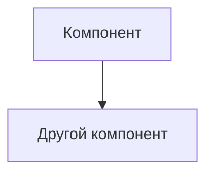

# ADR-<номер>: <Краткое описательное название>

**Статус:** ⚠️ На рассмотрении
**Участники:** Галина Литвинова 
**Дата:** 2025-07-24  

---

## 1. Контекст
Задача — повысить эффективность в сфере животноводства и по максимуму автоматизировать процессы, связанные с кормлением, безопасностью и мониторингом поголовья скота.

---

## 2. Требования

### Функциональные

**FURPS+**:
| Категория       | Требование                  |
|-----------------|-----------------------------|
| **F**1  		  | фиксировать признаки беспокойного поведения или драк среди животных и оповещать оператора |
| **F**2  		  | фиксировать признаки задавливания поросят |
| **F**3  		  | фиксировать признаки задавливания поросят |
| **F**4  		  | управлять кормушками и поилками разных производителей |
| **F**5  		  | оценивать состояние животных по внешнему виду и поведению: болезнь, гибель, беспокойство и так далее |
| **F**6  		  | следить за состоянием систем фильтрации воды |
| **F**7  		  | пересчитывать поголовье |
| **F**8  		  | следить за запасами еды и прогнозировать расход |
| **F**9  		  | делать пересчёт животных |
| **F**10  		  | предоставлять базовые метрики для передачи в другие системы |
| **U**1  		  | иметь разделение ролей и поддерживать современные способы аутентификации и авторизации        |
| **R**1  		  | обеспечивать достаточно высокую отказоустойчивость 99,95%        |
| **R**2  		  | работать даже в случае отсутствия интернета и при необходимости отправлять уведомления дежурному сотруднику на местах мониторинга, а после восстановления связи синхронизироваться с центральной системой |
| **R**3  		  | в синхронизации между агентами и центральным сервером допускается задержка до 10 минут без учёта проблем со связью |
| **R**4  		  | На ферме нестабильный WiFi, поэтому нужно продумать альтернативные каналы связи |
| **P**1  		  | от момента возникновения нештатной ситуации, зафиксированной с помощью видеоаналитики, должно проходить не более 5 секунд до момента оповещения        |
| **P**2  		  | позволять системе видеоаналитики реагировать в реальном времени (миллисекунды)        |
| **S**1  		  | поддерживать необходимое количество видеокамер для аналитики в реальном времени от разных производителей        |
| **S**2  		  | быть расширяемой, то есть иметь возможность разработать новый функционал без изменений существующего        |
| **S**3  		  | поддерживать возможность добавления собственных метрик        |
| **+**1  		  | быть построена по принципу «центральный сервер — агенты» на конкретных фермах без ограничения количества таких агентов        |
| **+**2  		  | На каждой ферме допустимо использовать один центральный сервер и необходимый набор edge-устройств |

**Или Use Cases**:
| UC-ID | Название | Основной поток | Альтернативные потоки |

### Нефункциональные
| Категория       | Требование                  | Критичность |
|-----------------|-----------------------------|-------------|
| <Отказоустойчивость> | <99.95%>              | <Высокая>   |
| <Производительность > | <от момента возникновения нештатной ситуации, зафиксированной с помощью видеоаналитики, должно проходить не более 5 секунд до момента оповещения>              | <Высокая>   |
| <Производительность > | <позволять системе видеоаналитики реагировать в реальном времени (миллисекунды)>              | <Высокая>   |

---

## 3. Решение

### Описание
<Детальное описание решения с диаграммами при необходимости>

### Аргументация

| Критерий         | Обоснование                 |
|------------------|-----------------------------|
|                  |                             |

#### Последствия

**✅ Положительные:**
- 
- 

**⚠️ Негативные:**
- 
- 

**↗️ Зависимости:**
- 

---

### 4. Альтернативы

| Вариант      | Плюсы                      | Минусы                     | Почему отклонен           |
|--------------|----------------------------|----------------------------|---------------------------|
|              |                            |                            |                           |

---

### 5. Риски

1. **<Название риска>**  
   *Меры:* 

2. **<Название риска>**  
   *Меры:* 

3. **<Название риска>**  
   *Меры:* 