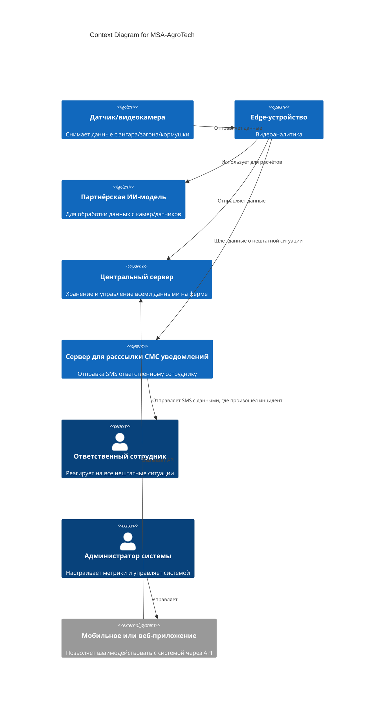
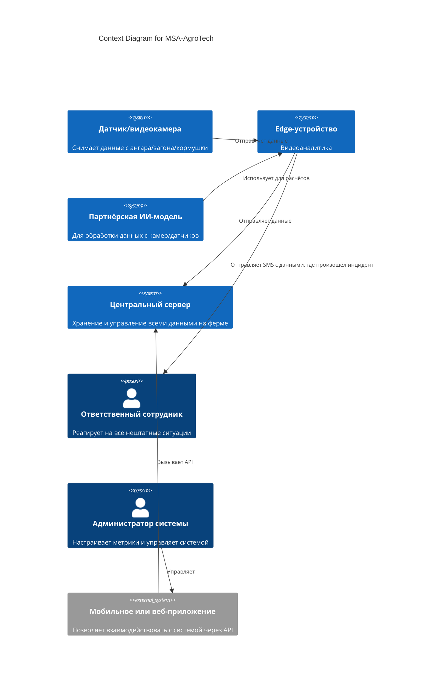

# ADR-<номер>: <Краткое описательное название>

**Статус:** ⚠️ На рассмотрении
**Участники:** Галина Литвинова
**Дата:** 2025-07-24

---

## 1. Контекст

Задача — повысить эффективность в сфере животноводства и по максимуму автоматизировать процессы, связанные с кормлением, безопасностью и мониторингом поголовья скота.

---

## 2. Требования

### Функциональные

**FURPS+**:
| Категория | Требование |
|-----------------|-----------------------------|
| **F**1 | фиксировать признаки беспокойного поведения или драк среди животных и оповещать оператора |
| **F**2 | фиксировать признаки задавливания поросят |
| **F**3 | управлять кормушками и поилками разных производителей |
| **F**4 | оценивать состояние животных по внешнему виду и поведению: болезнь, гибель, беспокойство и так далее |
| **F**5 | следить за состоянием систем фильтрации воды |
| **F**6 | пересчитывать поголовье |
| **F**7 | следить за запасами еды и прогнозировать расход |
| **F**8 | делать пересчёт животных |
| **F**9 | предоставлять базовые метрики для передачи в другие системы |
| **U**1 | иметь разделение ролей и поддерживать современные способы аутентификации и авторизации |
| **R**1 | обеспечивать достаточно высокую отказоустойчивость 99,95% |
| **R**2 | работать даже в случае отсутствия интернета и при необходимости отправлять уведомления дежурному сотруднику на местах мониторинга, а после восстановления связи синхронизироваться с центральной системой |
| **R**3 | в синхронизации между агентами и центральным сервером допускается задержка до 10 минут без учёта проблем со связью |
| **R**4 | На ферме нестабильный WiFi, поэтому нужно продумать альтернативные каналы связи |
| **P**1 | от момента возникновения нештатной ситуации, зафиксированной с помощью видеоаналитики, должно проходить не более 5 секунд до момента оповещения |
| **P**2 | позволять системе видеоаналитики реагировать в реальном времени (миллисекунды) |
| **S**1 | поддерживать необходимое количество видеокамер для аналитики в реальном времени от разных производителей |
| **S**2 | быть расширяемой, то есть иметь возможность разработать новый функционал без изменений существующего |
| **S**3 | поддерживать возможность добавления собственных метрик |
| **+**1 | быть построена по принципу «центральный сервер — агенты» на конкретных фермах без ограничения количества таких агентов |
| **+**2 | На каждой ферме допустимо использовать один центральный сервер и необходимый набор edge-устройств |

**Или Use Cases**:
| UC-ID | Название | Основной поток | Альтернативные потоки |

### Нефункциональные

| Категория          | Требование                                                                                                                                      | Критичность |
| ------------------ | ----------------------------------------------------------------------------------------------------------------------------------------------- | ----------- |
| Отказоустойчивость | 99.95%                                                                                                                                          | Высокая     |
| Производительность | от момента возникновения нештатной ситуации, зафиксированной с помощью видеоаналитики, должно проходить не более 5 секунд до момента оповещения | Высокая     |
| Производительность | позволять системе видеоаналитики реагировать в реальном времени (миллисекунды)                                                                  | Высокая     |

---

## 3. Решение

У каждого датчика/видеокамеры на ферме есть своё edge-устройство. Датчики отправляют данные агентам через проводную сеть (например, Ethernet). Агенты используют партнёрскую ИИ-модель для аналитики. Агенты отдают данные на центральный сервер на ферме через брокер сообщений. Центральный сервер собирает базовые метрики. У него есть API, благодаря которому через мобильное или веб-приложение можно добавить собственные метрики.
В случае нештатной ситуации агенты отправляют через проводную сеть уведомление на специальный агент для уведомлений, который, например, рассылает ответственным сотрудникам смс-оповещения. Таким образом, даже если сеть на ферме упадёт, они всё равно не пропустят нештатную ситуацию.
Альтернативное решение - каждое edge-устройство само умеет рассылать уведомление.

### Описание

Диаграмма C1



Альтернативный вариант:



### Аргументация

Для быстрого уведомления сотрудников (за милисекунды) предлагается отдельное устройство или служба, подключённая к локальной сети (или GSM-модему), которое принимает сообщения от edge-агентов и рассылает SMS/звонки.

#### Последствия

**✅ Положительные:**

- Разделение ответственности
- Легче добавлять нового агента (ему надо знать только интерфейсы передачи данных)
- Легче заменить
- **⚠️ Негативные:**
- Дополнительное оборудование (стоимость)
- Необходимость его настроить
- **↗️ Зависимости:**
- Может понадобиться дублирующее устройство
- ***

### 4. Альтернативы

| Вариант                                                      | Плюсы                                                                                 | Минусы | Почему отклонен |
| ------------------------------------------------------------ | ------------------------------------------------------------------------------------- | ------ | --------------- |
| Каждое edge-устройство отправляет уведомление самостоятельно | Независимость друг от друга; может быть проще для MVP;                                |
|                                                              | Нарушает чистоту архитектуры; тяжелее добавлять новые устройства; тяжелее тестировать |
|                                                              |                                                                                       |

---

### 5. Риски

1. **Падение сети на ферме**
   Поскольку агенты, камеры и сервер уведомлений находятся в проводной сети, то о нештатных ситуациях сотрудники будут уведомлены вовремя

2. **Выход из строя сервера уведомлений**
   Легко может быть продублирован

```

```
